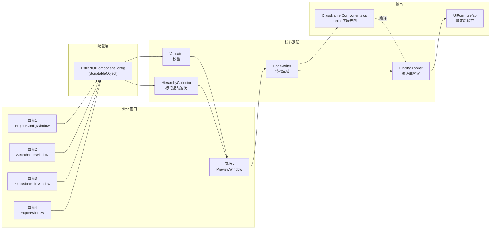

# ExtractUIComponent 类图

```mermaid
classDiagram

%% ─── 数据模型 ────────────────────────────────────────────────────────────────

class ExtractUIComponentConfig {
    +List~string~ ValidPrefabRootPaths
    +string FormBaseTypeFullName
    +List~ComponentExportRule~ ComponentRules
    +List~ComponentExclusionRule~ ExclusionRules
    +RulesWindowLayout RulesLayout
    +ExportMarkers Markers
    +GetOrCreate()$ ExtractUIComponentConfig
    +DeleteConfig()$
    +ResolveSavePath()$ string
    +GetDefaultRules()$ List~ComponentExportRule~
}

class ExportMarkers {
    +string Export
    +string Skip
    +string ExportPropagate
    +string SkipPropagate
    +ResetToDefault()
    +Validate() string
    +IsDefault bool
}

class ComponentExportRule {
    +bool IsEnabled
    +string ComponentTypeFullName
    +string FieldPrefix
}

class ComponentExclusionRule {
    +string TriggerTypeFullName
    +List~string~ ExcludedTypeFullNames
}

class RulesWindowLayout {
    +float PrefixColWidth
}

ExtractUIComponentConfig *-- ExportMarkers
ExtractUIComponentConfig *-- "0..*" ComponentExportRule
ExtractUIComponentConfig *-- "0..*" ComponentExclusionRule
ExtractUIComponentConfig *-- RulesWindowLayout

%% ─── 运行时数据传输对象 ────────────────────────────────────────────────────

class ExtractedComponentEntry {
    +string NodePath
    +string NodeName
    +Component Component
    +ComponentExportRule Rule
    +bool IsExcludedByDefault
}

class ComponentFieldEntry {
    +string FieldName
    +Type ComponentType
    +string NodePath
    +string AssemblyQualifiedTypeName
}

class ExtractUIComponentPendingBindings {
    +string PrefabAssetPath
    +string FormTypeName
    +List~ExtractUIComponentFieldBinding~ Fields
    +int RetryLeft
}

class ExtractUIComponentFieldBinding {
    +string FieldName
    +string NodePath
    +string ComponentTypeName
}

ExtractedComponentEntry --> ComponentExportRule
ExtractUIComponentPendingBindings *-- "0..*" ExtractUIComponentFieldBinding

%% ─── 核心逻辑类 ───────────────────────────────────────────────────────────

class ExtractUIComponentHierarchyCollector {
    <<static>>
    +Collect(prefabRoot, cfg)$ List~ExtractedComponentEntry~
    -Traverse(...)$
    -CollectComponents(...)$
    -ParseMarker(...)$ NodeMarker
    -StripMarker(...)$ string
}

class ExtractUIComponentCodeWriter {
    <<static>>
    +Execute(formComponent, fields, errorMessage)$ bool
    -TryFindMainScript(...)$
    -ExtractNamespace(...)$
    -CollectUsings(...)$
    -BuildComponentsFile(...)$
    -EnsurePartialKeyword(...)$
}

class ExtractUIComponentBindingApplier {
    <<static>>
    +StorePendingBindings(path, typeName, fields)$
    -TryApplyPendingBindings()$
    -FindComponentByPath(...)$
    -RetryOrClear(...)$
}

class ExtractUIComponentValidator {
    <<static>>
    +TryGetValidPrefab(prefabAsset, formComponent, error)$ bool
    +TryGetValidPrefabFromHierarchy(prefabAsset, formComponent, error)$ bool
    +FindTypeInAllAssemblies(typeName)$ Type
    -ValidateByPath(...)$
}

class ExtractUIComponentRuleDoc {
    <<static>>
    +Template$ string
    +Format(markers)$ string
    +FormatDefault()$ string
}

ExtractUIComponentHierarchyCollector --> ExtractUIComponentConfig
ExtractUIComponentHierarchyCollector ..> ExtractedComponentEntry : creates
ExtractUIComponentCodeWriter --> ExtractUIComponentBindingApplier
ExtractUIComponentCodeWriter ..> ComponentFieldEntry : consumes
ExtractUIComponentBindingApplier ..> ExtractUIComponentPendingBindings : serializes
ExtractUIComponentValidator --> ExtractUIComponentConfig
ExtractUIComponentRuleDoc --> ExportMarkers

%% ─── 菜单入口 ─────────────────────────────────────────────────────────────

class ExtractUIComponentEntry {
    <<static>>
    -MenuConfig$ string
    -MenuRules$ string
    -MenuExclusion$ string
    -MenuExport$ string
    -MenuUpdate$ string
    -MenuHierarchyUpdate$ string
    -OpenConfig()$
    -OpenRules()$
    -OpenExclusion()$
    -OpenExport()$
    -UpdateUIComponentFields()$
    -HierarchyUpdateUIComponentFields()$
}

ExtractUIComponentEntry --> ExtractUIComponentValidator
ExtractUIComponentEntry --> ExtractUIComponentHierarchyCollector
ExtractUIComponentEntry --> ExtractUIComponentPreviewWindow

%% ─── Editor 窗口 ──────────────────────────────────────────────────────────

class ExtractUIComponentProjectConfigWindow {
    <<EditorWindow>>
    -List~string~ m_PrefabRootPaths
    -string m_FormBaseTypeFullName
    -bool m_IsEditing
    +Open(existing, onCreated)$
    -TryCreate()
    -TryUpdate()
}

class ExtractUIComponentSearchRuleWindow {
    <<EditorWindow>>
    -List~ComponentExportRule~ m_Rules
    -ReorderableList m_List
    +Open()$
    -SaveToConfig()
    -BuildList()
}

class ExtractUIComponentExclusionRuleWindow {
    <<EditorWindow>>
    -List~ComponentExportRule~ m_Components
    -bool[,] m_Matrix
    +Open()$
    -LoadFromConfig()
    -SaveToConfig()
    -DrawColumnHeaders(...)
    -DrawRows(...)
}

class ExtractUIComponentExportWindow {
    <<EditorWindow>>
    -string[] m_EditValues
    -bool m_IsDirty
    +Open()$
    -SaveToConfig()
    -RefreshDoc()
    -DrawMarkersSection()
    -DrawDocSection()
}

class ExtractUIComponentPreviewWindow {
    <<EditorWindow>>
    -List~NodeRow~ m_Rows
    -HashSet~string~ m_DuplicateFieldNames
    +Open(prefabAsset, formComponent, entries)$
    -BuildRows(entries)
    -RefreshDuplicates()
    -RefreshFromPrefab()
    -ExecuteExport()
    -BuildFieldEntries() List~ComponentFieldEntry~
}

ExtractUIComponentProjectConfigWindow --> ExtractUIComponentConfig
ExtractUIComponentSearchRuleWindow --> ExtractUIComponentConfig
ExtractUIComponentExclusionRuleWindow --> ExtractUIComponentConfig
ExtractUIComponentExportWindow --> ExtractUIComponentConfig
ExtractUIComponentExportWindow --> ExtractUIComponentRuleDoc
ExtractUIComponentPreviewWindow --> ExtractUIComponentCodeWriter
ExtractUIComponentPreviewWindow --> ExtractUIComponentHierarchyCollector
ExtractUIComponentPreviewWindow ..> ComponentFieldEntry : creates

%% ─── 共享配色工具 ─────────────────────────────────────────────────────────

class ExtractUITableColors {
    <<static>>
    +RowEven$ Color
    +RowOdd$ Color
    +RowSelected$ Color
    +Splitter$ Color
}

ExtractUIComponentSearchRuleWindow --> ExtractUITableColors
ExtractUIComponentExclusionRuleWindow --> ExtractUITableColors
ExtractUIComponentPreviewWindow --> ExtractUITableColors
```

---

## 主要数据流

```mermaid
flowchart LR
    subgraph config [配置层]
        Config["ExtractUIComponentConfig\n(ScriptableObject)"]
    end

    subgraph ui [Editor 窗口]
        P1["面板1\nProjectConfigWindow"]
        P2["面板2\nSearchRuleWindow"]
        P3["面板3\nExclusionRuleWindow"]
        P4["面板4\nExportWindow"]
        P5["面板5\nPreviewWindow"]
    end

    subgraph logic [核心逻辑]
        Collector["HierarchyCollector\n标记驱动遍历"]
        Writer["CodeWriter\n代码生成"]
        Binder["BindingApplier\n编译后绑定"]
        Validator["Validator\n校验"]
    end

    subgraph output [输出]
        CS["ClassName.Components.cs\npartial 字段声明"]
        Prefab["UIForm.prefab\n绑定后保存"]
    end

    P1 --> Config
    P2 --> Config
    P3 --> Config
    P4 --> Config

    Config --> Collector
    Config --> Validator
    Validator --> P5
    Collector --> P5
    P5 --> Writer
    Writer --> CS
    Writer --> Binder
    CS -.->|编译| Binder
    Binder --> Prefab
```
